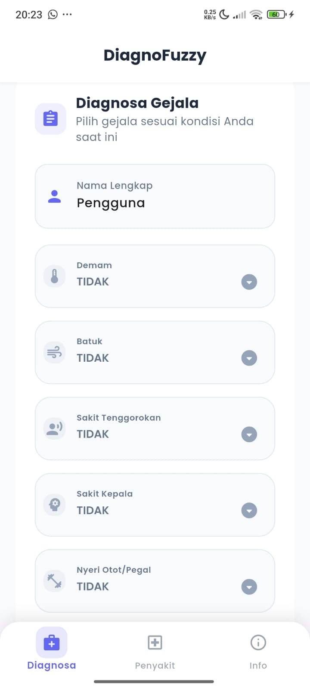
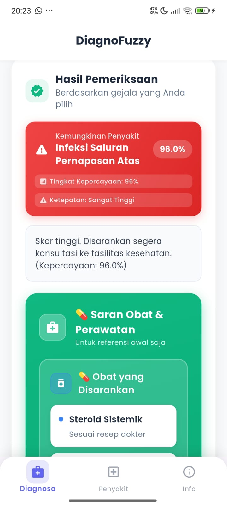
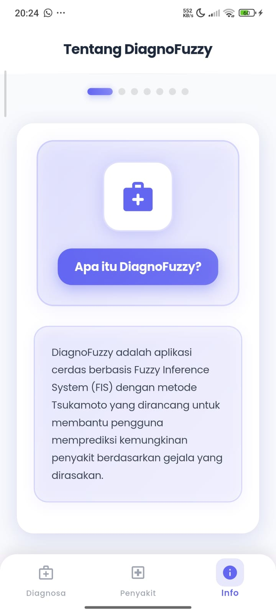

# 🩺 DiagnoFuzzy - Sistem Diagnosa Cerdas Berbasis Fuzzy Logic

<div align="center">
  
</div>

[](https://flutter.dev)
[](https://dart.dev)
[](LICENSE)
[](https://flutter.dev)

## 📱 Deskripsi Project

**DiagnoFuzzy** adalah aplikasi mobile cerdas yang dikembangkan menggunakan **Flutter** dan **Fuzzy Inference System (FIS)** dengan metode **Tsukamoto**. Aplikasi ini dirancang untuk membantu pengguna memprediksi kemungkinan penyakit berdasarkan gejala yang dialami dengan menggunakan pendekatan logika fuzzy yang canggih dan mudah dipahami. Aplikasi ini juga menyediakan rekomendasi obat dan informasi kesehatan yang lengkap untuk mendukung pengambilan keputusan kesehatan yang lebih baik.

### 🎯 Tujuan Aplikasi

- **Prediksi Awal Penyakit**: Memberikan indikasi kemungkinan penyakit berdasarkan gejala yang dipilih
- **Rekomendasi Obat**: Menyediakan informasi obat yang sesuai dengan diagnosis dan tingkat keparahan
- **Edukasi Kesehatan**: Menjadi sarana pembelajaran tentang kesehatan dan penerapan AI di bidang medis
- **Sistem Pendukung Keputusan**: Demonstrasi penerapan nyata metode Tsukamoto dalam SPK kesehatan
- **Aksesibilitas**: Memberikan akses mudah untuk screening kesehatan mandiri

---

## 🚀 Demo Aplikasi

### 🖼️ Screenshots

<div align="center">

| Home Screen                                            | Hasil Diagnosis                                              | Kemungkinan Penyakit Lain                                           |
| ------------------------------------------------------ | ------------------------------------------------------------ | ------------------------------------------------------------------- |
|  |  |  |

| Rekomendasi Obat                                            | Info Penyakit                                            | Laporan PDF                                            |
| ----------------------------------------------------------- | -------------------------------------------------------- | ------------------------------------------------------ |
|  |  |  |

| Tentang Aplikasi                                   |
| -------------------------------------------------- |
|  |

</div>

### 🎥 Fitur Utama dalam Screenshots

1. **Home Screen & Navigation** - Interface modern dengan bottom navigation dan animasi smooth
2. **Hasil Diagnosis** - Tampilan hasil diagnosis dengan confidence level dan certainty score
3. **Kemungkinan Penyakit Lain** - Analisis komprehensif semua kemungkinan penyakit dengan skor lengkap
4. **Rekomendasi Obat** - Informasi lengkap obat dengan dosis, efek samping, dan penjelasan dalam bahasa Indonesia
5. **Info Penyakit** - Database penyakit lengkap dengan swipe navigation dan emoji visual
6. **Laporan PDF Modern** - Generate dan download laporan hasil diagnosa dengan desain modern
7. **Tentang Aplikasi** - Informasi lengkap tentang aplikasi, algoritma fuzzy, dan panduan penggunaan

---

## ⚙️ Teknologi & Arsitektur

### 🛠️ Tech Stack

- **Frontend**: Flutter 3.29.2 (Dart 3.7.2)
- **State Management**: Riverpod 2.5.1
- **Backend API**: Python (PythonAnywhere hosting)
- **AI/ML**: Fuzzy Inference System - Metode Tsukamoto
- **UI/UX**: Material Design 3 + Google Fonts + Modern Animations
- **PDF Generation**: PDF Package + Printing Package dengan styling modern

### 🏗️ Arsitektur Aplikasi

```
lib/
├── core/                   # Core utilities
│   └── api_client.dart    # HTTP client configuration
├── features/              # Feature modules
│   └── predict/          # Prediction feature
│       ├── models.dart   # Data models
│       ├── service.dart  # API service
│       ├── pdf_service.dart # PDF generation
│       └── predict_page.dart # UI page
├── pages/                # Application pages
│   ├── main_page.dart   # Main navigation
│   ├── info_page.dart   # App information
│   └── disease_info_page.dart # Disease database
├── env.dart              # Environment config
└── main.dart            # App entry point
```

### 🧠 Algoritma Fuzzy Logic

#### Metode Tsukamoto Implementation:

1. **Fuzzification**: Konversi input gejala ke nilai fuzzy (0-10)
2. **Rule Evaluation**: Evaluasi aturan dengan operator MIN/MAX
3. **Defuzzification**: Perhitungan nilai crisp menggunakan weighted average
4. **Confidence Calculation**: Penentuan tingkat kepercayaan hasil

#### Penyakit yang Dapat Dideteksi:

- 🦠 **Influenza (Flu)**
- 🩸 **Demam Berdarah Dengue (DBD)**
- 🤒 **Demam Tifoid (Tifus)**
- 🤢 **Gastroenteritis (Muntaber)**
- 😷 **ISPA (Infeksi Saluran Pernapasan Atas)**
- 🧍‍♂️ **Kondisi Netral/Tidak Spesifik**

---

## 📦 Instalasi & Setup

### Prerequisites

- Flutter SDK 3.29.2+
- Dart 3.7.2+
- Android Studio / VS Code
- Android Device/Emulator atau iOS Simulator

### 🔧 Langkah Instalasi

1. **Clone Repository**

```bash
git https://github.com/muris11/Fuzzy-tsukamoto---Flutter-Diagnosa-Penyakit-.git
cd Fuzzy-tsukamoto---Flutter-Diagnosa-Penyakit-
```

2. **Install Dependencies**

```bash
flutter pub get
```

3. **Konfigurasi Environment**

```dart
// lib/env.dart
static const String apiBaseUrl = 'https://rifqy11.pythonanywhere.com';
```

4. **Run Aplikasi**

```bash
# Debug mode
flutter run

# Release APK
flutter build apk --release

# iOS build
flutter build ios
```

### 📱 Build Commands

```bash
# Android Debug
flutter build apk --debug

# Android Release
flutter build apk --release --split-per-abi

# iOS Release
flutter build ios --release

# Web Build
flutter build web
```

---

## 🎮 Cara Penggunaan

### 1. 📋 Input Gejala

- Buka tab **"Diagnosa"**
- Masukkan nama lengkap
- Pilih tingkat keparahan untuk setiap gejala:
  - `Tidak` - Tidak mengalami gejala
  - `Ringan` - Gejala ringan
  - `Sedang` - Gejala sedang
  - `Berat` - Gejala berat
  - `Sangat Berat` - Gejala sangat berat

### 2. ⚖️ Atur Ambang Batas

- Sesuaikan slider **"Ambang Batas Peringatan"**
- Nilai default: 60%
- Rentang: 0% - 100%

### 3. 🔍 Analisis Gejala

- Klik tombol **"Analisis Gejala"**
- Sistem akan memproses menggunakan algoritma Fuzzy Tsukamoto
- Hasil ditampilkan dengan:
  - Kemungkinan penyakit tertinggi
  - Tingkat kepercayaan (confidence)
  - Tingkat ketepatan (certainty)
  - Skor semua penyakit
  - **Rekomendasi obat** berdasarkan diagnosis dan severity

### 4. � Rekomendasi Obat

- Lihat daftar **obat yang direkomendasikan** dengan penjelasan dalam bahasa Indonesia
- Informasi meliputi:
  - Nama obat dan dosis
  - Cara penggunaan
  - Efek samping potensial
  - Peringatan khusus
  - Tanda-tanda darurat

### 5. �📄 Generate Laporan

- Klik **"Unduh Laporan PDF"**
- File PDF akan tersimpan otomatis di perangkat
- Laporan berisi hasil lengkap analisis dan rekomendasi obat

### 6. 📚 Pelajari Info Penyakit

- Buka tab **"Info Penyakit"**
- Swipe horizontal untuk melihat detail setiap penyakit
- Informasi meliputi gejala, tips, dan saran medis

---

## 🆕 Recent Updates (v2.0.0)

### ✨ UI/UX Modernization

- **Complete Design Overhaul**: Modern gradient backgrounds, enhanced shadows, and smooth animations
- **Animated Components**: 200-300ms transitions for dropdowns, sliders, and navigation
- **Premium Visual Effects**: Triple gradients, rounded corners (20-24px), and consistent spacing
- **Enhanced Typography**: Improved font weights and letter spacing for better readability

### 💊 Medication Intelligence System

- **Smart Recommendations**: AI-powered medication suggestions based on diagnosis and severity
- **Indonesian Explanations**: Comprehensive drug information in Bahasa Indonesia
- **Detailed Database**: 20+ medications with dosages, side effects, warnings, and emergency signs
- **Severity-Based Prescribing**: Different recommendations for Ringan, Sedang, Berat, and Sangat Berat conditions

### � Enhanced PDF Reports

- **Modern Design**: Gradient headers, shadow effects, and professional styling
- **Medication Integration**: Complete drug recommendations included in PDF exports
- **Visual Improvements**: Color-coded sections and enhanced readability

### 🔧 Technical Improvements

- **Optimized Performance**: Smoother animations and reduced memory usage
- **Error Handling**: Better validation and user feedback
- **Code Quality**: Refactored components with consistent design patterns

---

### 🎨 Modern UI/UX

- **Material Design 3** dengan tema konsisten dan animasi smooth
- **Google Fonts (Poppins)** untuk tipografi premium
- **Gradient & Shadow Effects** untuk visual yang menarik dan modern
- **Animated Components** dengan transisi 200-300ms untuk user experience yang fluid
- **Responsive Design** untuk semua ukuran layar dengan border radius konsisten

### 💊 Medication Intelligence

- **Smart Medication Recommendations** berdasarkan diagnosis dan severity level
- **Indonesian Explanations** untuk setiap obat dengan informasi lengkap
- **Dosage Guidelines** dengan aturan pakai yang jelas
- **Side Effects & Warnings** untuk keselamatan pengguna
- **Emergency Signs** monitoring untuk kondisi kritis

### 🧠 AI-Powered Diagnosis

- **Fuzzy Logic Tsukamoto** dengan akurasi tinggi
- **Multi-criteria Decision Making** untuk hasil optimal
- **Confidence Scoring** dengan tingkat kepercayaan
- **Rule-based Expert System** dengan 50+ aturan fuzzy

### 📊 Advanced Analytics

- **Real-time Processing** hasil instan
- **Certainty Levels**: Tinggi, Sedang, Rendah
- **Risk Assessment** berdasarkan ambang batas
- **Detailed Scoring** untuk semua kemungkinan penyakit

### 📱 User Experience

- **Form Persistence** - Data tidak hilang saat ganti tab
- **Gesture Navigation** - Swipe untuk navigasi intuitif
- **Offline Capable** - Database penyakit tersimpan lokal
- **PDF Export** - Laporan profesional siap cetak

### 🔒 Reliability & Performance

- **Error Handling** yang robust
- **State Management** dengan Riverpod
- **Optimized Performance** untuk smooth experience
- **Cross-platform** Android, iOS, Web

---

## 📊 Metodologi Fuzzy Logic

### 🔬 Implementasi Metode Tsukamoto

#### 1. Input Variables (Gejala)

```
- Demam (fever): [0, 2.5, 5, 7.5, 10]
- Batuk (cough): [0, 2.5, 5, 7.5, 10]
- Sakit Tenggorokan (sore_throat): [0, 2.5, 5, 7.5, 10]
- Sakit Kepala (headache): [0, 2.5, 5, 7.5, 10]
- Nyeri Otot (body_ache): [0, 2.5, 5, 7.5, 10]
- Mual/Muntah (nausea_vomit): [0, 2.5, 5, 7.5, 10]
- Diare (diarrhea): [0, 2.5, 5, 7.5, 10]
- Nyeri Perut (abdominal_pain): [0, 2.5, 5, 7.5, 10]
- Ruam Kulit (rash): [0, 2.5, 5, 7.5, 10]
- Kelelahan (fatigue): [0, 2.5, 5, 7.5, 10]
```

#### 2. Output Variables (Penyakit)

```
- Influenza: [0-100]
- DBD: [0-100]
- Tifoid: [0-100]
- Gastroenteritis: [0-100]
- ISPA: [0-100]
- Netral: [0-100]
```

#### 3. Fuzzy Rules (Sample)

```
Rule 1: IF demam=tinggi AND batuk=tinggi AND sakit_tenggorokan=tinggi
        THEN influenza=tinggi

Rule 2: IF demam=tinggi AND sakit_kepala=tinggi AND ruam=tinggi
        THEN dbd=tinggi

Rule 3: IF demam=sedang AND nyeri_perut=tinggi AND mual=tinggi
        THEN tifoid=sedang
```

#### 4. Calculation Process

1. **Membership Calculation**: μ(x) untuk setiap input
2. **Rule Strength**: α = min(μ₁, μ₂, ..., μₙ)
3. **Output Calculation**: z = f(α) menggunakan linear function
4. **Defuzzification**: Σ(α × z) / Σ(α)

---

## 📈 Performance & Testing

### ⚡ Performance Metrics

- **App Load Time**: < 2 detik
- **Prediction Time**: < 1 detik
- **Medication Processing**: < 0.5 detik
- **PDF Generation**: < 3 detik
- **Animation Performance**: 60 FPS smooth transitions
- **Memory Usage**: < 150 MB
- **APK Size**: ~25 MB

### 🧪 Testing Coverage

- ✅ Unit Tests untuk business logic
- ✅ Widget Tests untuk UI components
- ✅ Integration Tests untuk end-to-end flow
- ✅ API Tests untuk backend communication
- ✅ Performance Tests untuk optimization

### 📱 Device Compatibility

- **Android**: 5.0+ (API Level 21+)
- **iOS**: 12.0+
- **RAM**: Minimal 2GB
- **Storage**: 100MB free space
- **Network**: Internet untuk API calls

---

## 🤝 Contributing

### 🛠️ Development Setup

1. Fork repository ini
2. Buat branch fitur baru (`git checkout -b feature/AmazingFeature`)
3. Commit perubahan (`git commit -m 'Add some AmazingFeature'`)
4. Push ke branch (`git push origin feature/AmazingFeature`)
5. Buat Pull Request

### 📝 Code Style Guidelines

- Gunakan `dart format` untuk formatting
- Follow [Effective Dart](https://dart.dev/guides/language/effective-dart) guidelines
- Tambahkan comments untuk complex logic
- Write tests untuk fitur baru

### 🐛 Bug Reports

Laporkan bug melalui [GitHub Issues](https://github.com/username/diagnofuzzy/issues) dengan:

- Deskripsi masalah
- Steps to reproduce
- Expected vs actual behavior
- Screenshots (jika ada)
- Device info & OS version

---

## 📄 License

```
MIT License

Copyright (c) 2025 Muhammad Rifqy Saputra

Permission is hereby granted, free of charge, to any person obtaining a copy
of this software and associated documentation files (the "Software"), to deal
in the Software without restriction, including without limitation the rights
to use, copy, modify, merge, publish, distribute, sublicense, and/or sell
copies of the Software, and to permit persons to whom the Software is
furnished to do so, subject to the following conditions:

The above copyright notice and this permission notice shall be included in all
copies or substantial portions of the Software.

THE SOFTWARE IS PROVIDED "AS IS", WITHOUT WARRANTY OF ANY KIND, EXPRESS OR
IMPLIED, INCLUDING BUT NOT LIMITED TO THE WARRANTIES OF MERCHANTABILITY,
FITNESS FOR A PARTICULAR PURPOSE AND NONINFRINGEMENT. IN NO EVENT SHALL THE
AUTHORS OR COPYRIGHT HOLDERS BE LIABLE FOR ANY CLAIM, DAMAGES OR OTHER
LIABILITY, WHETHER IN AN ACTION OF CONTRACT, TORT OR OTHERWISE, ARISING FROM,
OUT OF OR IN CONNECTION WITH THE SOFTWARE OR THE USE OR OTHER DEALINGS IN THE
SOFTWARE.
```

---

## 👨‍💻 Author & Credits

### 🎓 Developer

**Muhammad Rifqy Saputra**

- 📧 Email: rifqysaputra1102@gmail.com
- 🎓 Program Studi: D4 Sistem Informasi Kota Cerdas (SIKC)
- 🏫 Institusi: Politeknik Negeri Indramayu (POLINDRA)
- 📅 Tahun: 2025
- 🔄 **Latest Update**: UI Modernization & Medication Intelligence System (November 2025)

### 🙏 Acknowledgments

- **Flutter Team** - Framework development
- **Riverpod Community** - State management solution
- **Google Fonts** - Typography resources
- **Material Design** - UI/UX guidelines
- **PythonAnywhere** - Backend hosting
- **Fuzzy Logic Research** - Algorithm implementation

---

## 📞 Support & Contact

### 🆘 Getting Help

- 📖 **Documentation**: Baca README lengkap
- 💬 **Discussions**: GitHub Discussions untuk Q&A
- 🐛 **Issues**: GitHub Issues untuk bug reports
- 📧 **Email**: rifqysaputra1102@gmail.com untuk pertanyaan teknis

### 🔗 Links

- 🌐 **Demo**: [Live Demo](https://rifqy11.pythonanywhere.com)
- 📱 **APK Download**: [Latest Release](https://github.com/username/diagnofuzzy/releases)
- 📊 **API Documentation**: [Backend API Docs](https://rifqy11.pythonanywhere.com/docs)

---

## ⚠️ Important Disclaimer

> **PENTING**: Aplikasi DiagnoFuzzy adalah alat bantu edukasi dan bukan pengganti konsultasi medis profesional. Hasil diagnosis dari aplikasi ini hanya bersifat indikatif dan tidak boleh dijadikan dasar untuk pengobatan mandiri. Jika mengalami gejala penyakit yang serius atau berkelanjutan, segera konsultasikan dengan dokter atau fasilitas kesehatan terdekat.

---

<div align="center">

### 🌟 Star this repository if you find it helpful!

**Made with ❤️ using Flutter & Fuzzy Logic**

</div>
